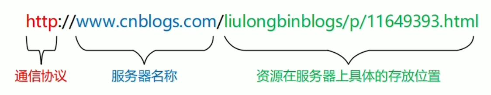
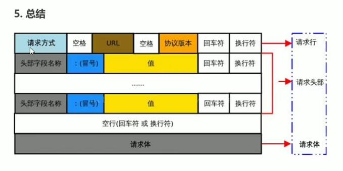
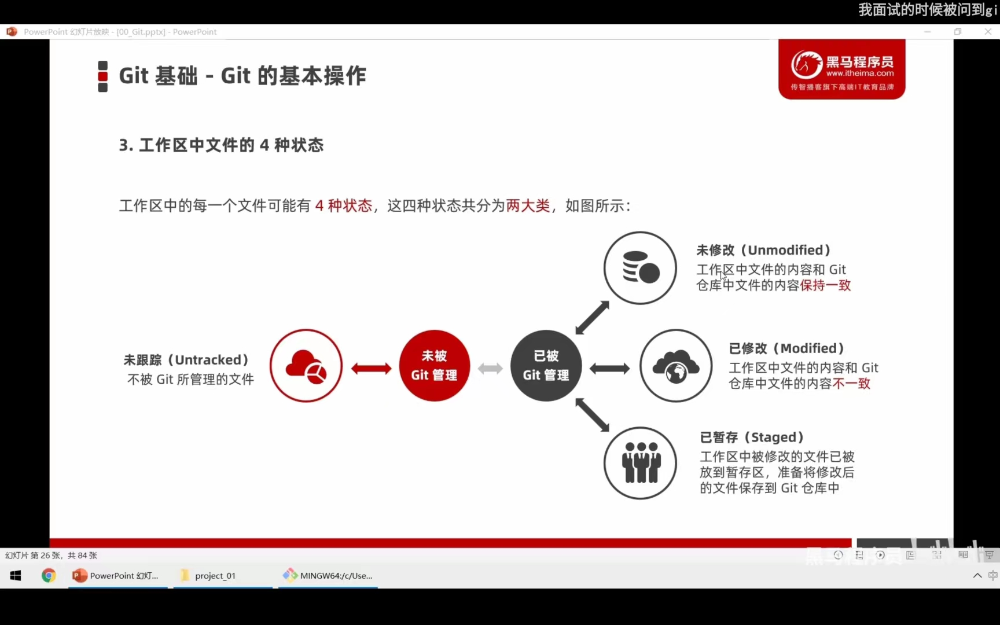
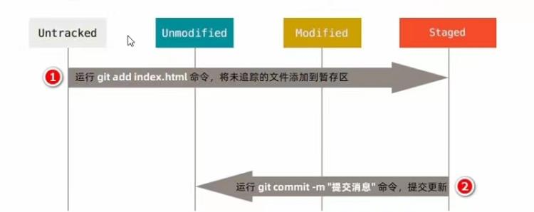
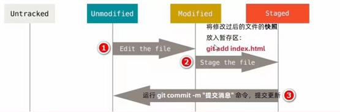
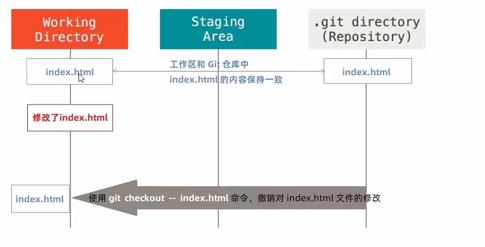
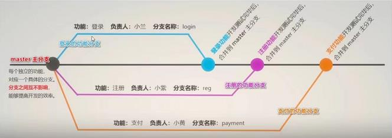

# ajax
```
懒加载其实就是延时加载，即当对象需要用到的时候再去加载相关的对象
```
## 服务器
上网过程中，负责存放和对外提供资源的电脑，叫做服务器。
## 客户端
上网过程中，负责获取和消费资源的电脑，叫做客户端。

## URL地址的概念
```
URL(全称是UniformResourceLocator)中文叫统一资源定位符，用于标识互联网上每个资源的唯一存放位置。浏览器只有通过URL地址，才能正确定位资源的存放位置，从而成功访问到对应的资源。
```
## URL地址的组成部分
```
URL地址一般由三部组成:
客户端与服务器之间的通信协议
存有该资源的服务器名称
资源在服务器上具体的存放位置
```


## 基于浏览器的开发者工具分析通信过程

```
1．打开Chrome浏览器
2. Ctrl+Shift+l打开Chrome的开发者工具
3.切换到Network面板
4．选中Doc页签
5．刷新页面，分析客户端与服务器的通信过程
```
## 网页中如何请求数据
```
数据，也是服务器对外提供的一种资源。只要是资源，必然要通过请求-处理–响应的方式进行获取。
如果要在网页中请求服务器上的数据资源，则需要用到XMLHttpRequest对象。
XMLHttpRequest(简称xhr)是浏览器提供的js成员，通过它，可以请求服务器上的数据资源。最简单的用法 var xhrObj = new XMLHttpRequest();
```
## 资源的请求方式
```
客户端请求服务器时，请求的方式有很多种，最常见的两种请求方式分别为get和post请求。
get请求通常用于获取服务端资源（向服务器要资源)
post 请求通常用于向服务器提交数据(往服务器发送资源)
```

## AJAX简介
```
AJAX全称为Asynchronous JavaScript And XML，就是异步的JavaScript和 XML。
通过AJAX可以在浏览器中向服务器发送异步请求，最大的优势:无刷新获取数据。AJAX不是新的编程语言，而是一种将现有的标准组合在一起使用的新方式。
```
## XML简介
```
XML可扩展标记语击。
XML被设计用来传输和存储数据。
XML和HTML类似，不同的是HTML中都是预定义标签，而XML中没有预定义标签，全都是自定义标签，用来表示一些数据。
```
## AJAX的特点
```
1.3.1 AJAX的优点

1)可以无需刷新页面而与服务器端进行通信。
2)允许你根据用户事件来更新部分页面内容。

1.3.2 AJAX的缺点

1)没有浏览历史，不能回退
2)存在跨域问题(同源)
3)SEO不友好
```
# HTTP
```
HTTP (hypertext transport protocol)协议『超文本传输协议』﹐协议详细规定了浏览器和万维网服务器之间互相通信的规则。约定，规则
```
## 了解jQuery中的Ajax
```
jQuery中发起Ajax请求最常用的三个方法如下:
$.get()
$.post()
$.ajax()

jQuery中 $.get(函数的功能单一，专门用来发起get请求，从而将服务器上的资源请求到客户端来进行使用。
语法：
$.get (ur1,[data], [callback])
```

参数名 | 参数类型 | 是否必选 | 说明
--- | --- | --- |--- 
url | string | 是 | 要请求的资源地址
data | object | 否 | 请求资源期间要携带的参数(以对象形式)
callback | function | 否 | 请求成功时的回调函数

```
jQuery 中 $.post()函数的功能单一，专门用来发起post请求，从而向服务器提交数据。
$.post()函数的语法如下:
$.post(ur1,[data], [callback]);

```
## $.ajax()函数的语法
```JavaScript
相比于$.get(和$.post0函数，jQuery 中提供的$.ajax()函数，是一个功能比较综合的函数，它允许我们对Ajax请求进行更详细的配置。

$.ajax ({
type: " "   //请求的方式，例如GET或POST
ur1: ''  //请求的URL地址
data: { }   //这次请求要携带的数据
success: function (res) { })//请求成功之后的回调函数
```
## 接口
```
使用Ajax请求数据时，被请求的URL地址，就叫做数据接口（简称接口)。同时，每个接口必须有请求方式.

什么是接口测试工具
为了验证接口能否被正常被访问，我们常常需要使用接口测试工具，来对数据接口进行检测。好处:接口测试工具能让我们在不写任何代码的情况下，对接口进行调用和测试。

什么是接口文档
接口文档，顾名思义就是接口的说明文档，它是我们调用接口的依据。好的接口文档包含了对接口URL，参数以及输出内容的说明，我们参照接口文档就能方便的知道接口的作用，以及接口如何进行调用。

接口文档的组成部分
1.接口名称:用来标识各个接口的简单说明，如登录接口，获取图书列表接口等。
2.接口URL:接口的调用地址。
3.调用方式:接口的调用方式，如GET或POST。
4.参数格式:接口需要传递的参数，每个参数必须包含参数名称、参数类型、是否必选、参数说明这4项内容。
5.响应格式:接口的返回值的详细描述，一般包含数据名称、数据类型、说明3项内容。
6.返回示例(可选):通过对象的形式，例举服务器返回数据的结构。
```
## form 表单属性

属性 | 属性值 
 --- | --- 
1.action | url
2.target | 跳转方式
3.method | 提交方式
4.enctype | 发送表单数据之前如何对数据进行编码(applicationx-www-form-urlencoded在发送前编码所有字符(默认)multipart/form-data不对字符编码。在使用包含文件上传控件的表单时，必须使用该值。)


```
注意:
1.get方式适合用来提交少量的、简单的数据。
2.post方式适合用来提交大量的、复杂的、或包含文件上传的数据。
3.在实际开发中，<form>表单的post提交方式用的最多，很少用get。例如登录、注册、添加数据等表单操作，都需要使用post方式来提交表单。
在涉及到文件上传的操作时，必须将enctype的值设置为multipart/form-data
4.2如果表单的提交不涉及到文件上传操作，则直接将enctype的值设置为application/x-www-form-urlencoded即可!

```
```
1.什么是表单的同步提交
通过点击submit 按钮，触发表单提交的操作，从而使页面跳转到action URL的行为，叫做表单的同步提交。
2表单同步提交的缺点
<form>表单同步提交后，整个页面会发生跳转，跳转到action URL所指向的地址，用户体验很差。
<form>表单同步提交后，页面之前的状态和数据会丢失。
```
## 快速获取表单中的数据
```
$ ('#form1').serialize();

输出结果：
usernane=用户名的值&password=密码的值
！！！！必须给表单内容增加name的属性
！！！ 重置表单方法 $("#formAddcmt")[0].reset()

```
## 模板引擎
```
什么是模板引擎
模板引擎，顾名思义，它可以根据程序员指定的模板结构和数据，自动生成一个完整的HTML页面。

```
## art-template模板引擎

```JavaScript
1.导入art-template

2.定义模板 
<script type="text/html" id="target">
    <h1>{{name}}</h1>
</script>
3.定义数据
<script>
    let data = {
            name: 'zhangsan'
        }
   
</script>
4.调用template函数 //模板id，要渲染的数据
 $('.box').append(template('target', data))
5.渲染HTML结构

art-template标准语法
1.标准语法{{}}
2.如果要输出的value值中，包含了HTML标签结构，则需要使用原文输出语法，才能保证HTML标签被正常渲染。({{@value}})
3.标准语法–条件输出
{{ if value}}按需输出的内容{{/if}}
{{if v1}}按需输出的内容{{else if v2}}按需输出的内容 {{/if} }
4.循环渲染
{{each arr}}
{{$index}}{{$value}}//$index是索引号   $value是元素
{/each}}


```
## 标准语法-过滤器
```
过滤器的本质，就是一个function处理函数。
{ {value |  filterName } }
template.defaults.imports.filterName = function(value){/*return处理的结果*/}

```

## 步骤
```
1.实现步骤
2.获取新闻数据
3.定义template模板
编译模板
4.定义时间过滤器
5.定义补零函数

```
## 正则与字符串操作
```JavaScript
1.基本语法
exec()函数用于检索字符串中的正则表达式的匹配。
如果字符串中有匹配的值，则返回该匹配值，否则返回null。

例子：
var str = 'hello'
var pattern = /o/
//输出的结果["o"，index: 4, input: "hello"，groups: undefined]
//匹配失败则返回null
console.log(pattern.exec(str))

2.分组
正则表达式中()包起来的内容表示一个分组，可以通过分组来提取自己想要的内容
let longstr = '<div>我是{{name}}</div>'
    let rg2 = /{{([a-zA-Z]+)}}/;
    let rg3 = /{{[a-zA-Z]+}}/;
    console.log(rg3.exec(longstr));
    //输出['{{name}}', index: 7, input: '<div>我是{{name}}</div>', groups: undefined]
    console.log(rg2.exec(longstr));
    //输出['{{name}}', 'name', index: 7, input: '<div>我是{{name}}</div>', groups: undefined]
```

```JavaScript
1.字符串的replace函数

1.1多次 replace 

let longstr = '<div>我是{{name}} 今年{{ age }}岁</div>'
  let rg4 = /{{\s*([a-z]+)\s*}}/
    var pp = rg4.exec(longstr);
    longstr = longstr.replace(pp[0], pp[1])
    console.log(longstr);//<div>我是name 今年{{ age }}岁</div>
    var pp = rg4.exec(longstr);
    longstr = longstr.replace(pp[0], pp[1])
    console.log(longstr);//<div>我是name 今年age岁</div>
    var pp = rg4.exec(longstr);
    console.log(pp); //null

    //或者使用while循环
      while (rg4.exec(longstr)) {
        longstr = longstr.replace(rg4.exec(longstr)[0], rg4.exec(longstr)[1]);
        // var pp = rg4.exec(longstr);
    }
    console.log(longstr);

1.2replace替换为真值
data={
    name:'zhangsan',
    age:'15'
}
  while (rg4.exec(longstr)) {
        longstr = longstr.replace(rg4.exec(longstr)[0], data[rg4.exec(longstr)[1]]);
        // var pp = rg4.exec(longstr);
    }
    console.log(longstr);

```
## Ajax加强
```
1.XMLHttpRequest的基本使用

1.1什么XMLHttpRequest
XMLHttpRequest(简称xhr)是浏览器提供的Javascript对象，通过它，可以请求服务器上的数据资源。之前所学的jQuery中的Ajax函数，就是基于xhr对象封装出来的。
```
>XMLHttpRequest
>>jQuery中的Ajax
>>>  $.get()
>>>  $.post()
>>>  $.ajax()

## 使用xhr发起GET请求
### 不带参数的get请求
```JavaScript
//1.创建xhr对象
var xhr=new XMLHttpRequest();
//2.调用open函数 ，指定 请求方式和URL地址
xhr.open('GET','http://www.liulongbin.top:3006/api/getbooks');
//3.使用send函数，发起Ajax请求
xhr.send();
//4.监听onreadystatechange事件
xhr.onreadystatechange=()=>{
    //4.1监听xhr对象的请求状态readyState；与服务器响应状态 status
    if(xhr.readyState===4 && xhr.status==200){//xhr.readyState和xhr.status是请求状态的一部分，不是数据一部分
        console.log(xhr.responseText)
    }
}
```
### 带参数的get请求(open()函数里面的url追加请求数据)
```JavaScript
//1.创建xhr对象
var xhr=new XMLHttpRequest();
//2.调用open函数 ，指定 请求方式和URL地址
xhr.open('GET','http://www.liulongbin.top:3006/api/getbooks?id=1');
//3.使用send函数，发起Ajax请求
xhr.send();
//4.监听onreadystatechange事件
xhr.onreadystatechange=()=>{
    //4.1监听xhr对象的请求状态readyState；与服务器响应状态 status
    if(xhr.readyState===4 && xhr.status==200){//xhr.readyState和xhr.status是请求状态的一部分，不是数据一部分
        console.log(xhr.responseText)
    }
}
```
## 了解xhr对象的readyState属性
```
XHLHttpRequest对象的readyStates属性，用来表示当前Ajax请求所处状态，每个Ajax必然处于以下状态之一：
```
值 | 状态 | 描述 
--- |  --- |  --- 
0 | UNSET | XMLHttpRequest对象已被创建，但未调用open方法
1 | OPENDED | open()方法已经被调用
2 | HEADERS_RECEIVED |  send()方法已经被调用，响应头已经被接收
3 | LOADING | 数据接收中，此时reponse属性中已经包含部分数据
4 | DONE | Ajax请求完成，这意味着数据传输已经彻底的完成和失败

## 查询字符串
```
定义：查询字符串（url参数）是指在url末尾加上用于向服务器发送信息的字符串变量（变量）
格式：将英文的？放在url末尾，然后加上 参数=值 多个参数用&连接
```
## URL编码和解码
```
URL不容许用中文编码，得转义(编码) 即用英文字符表示非英文字符

encodeURI('黑马')//非英文转英文
decodeURI('%E8%8A%B1%E5%BC%80%E8%A7%')//英文转非英文

```
### xr发起post请求
```JavaScript
//1.创建xhr对象
var xhr=new XMLHttpRequest();
//2.调用open函数 ，指定 请求方式和URL地址
xhr.open('POST','http://www.liulongbin.top:3006/api/getbooks');
//3.设置Content-Type属性(固定写法)
xhr.setRequestHeader('Content-Type','application/x-www-form-urlencoded')
//4.使用send函数，发起Ajax请求
xhr.send('bookname=水浒传&author=施耐庵&publisher=天津图书出版社');
//5.监听onreadystatechange事件
xhr.onreadystatechange=()=>{
    //5.1监听xhr对象的请求状态readyState；与服务器响应状态 status
    if(xhr.readyState===4 && xhr.status==200){//xhr.readyState和xhr.status是请求状态的一部分，不是数据一部分
        console.log(xhr.responseText)
    }
}
```
## 数据交换格式
```html
定义：服务器端 和 客户端 之间进行 数据传输与交换的格式
常用XML和JSON

```
## XML
```html
XML的英文全称是EXtensible Markup Language，即 可扩展标记语言 。因此，XML和HTML类似，也是一种标记语言。

html:
<!DOCTYPE html><html>
<head>
<title>Document</title>
</head>
<body></body>
</html>

xml:
<note>
<to>ls</to>
<from>zs</from>
<heading>通知</heading>
<body>晚上开会</body>
</note>

2.XML和HTML的区别
XML和HTML虽然都是标记语言，但是，它们两者之间没有任何的关系。HTML被设计用来描述网页上的内容，是网页内容的载体
XML被设计用来传输和存储数据，是数据的载体

3.XML缺点
3.1 XML格式臃肿，和数据无关的代码多，体积大，传输效率低
3.2 在Javascript中解析XML 比较麻烦

```
## JSON
```
概念:JSON 的英文全称是JavaScript Object Notation，即“JavaScript对象表示法”。简单来讲，JSON就是Javascript对象和数组的字符串表示法，它使用文本表示一个JS对象或数组的信息，因此,JSON的本质是字符串。

作用:JSON是一种轻量级的文本数据交换格式，在作用上类似于XML，专门用于存储和传输数据，但是JSON比 XML 更小、更快、更易解析。

现状:JSON 是在2001年开始被推广和使用的数据格式，到现今为止，JSON已经成为了主流的数据交换格式。
 
```
## Json两种结构

```html
对象结构:对象结构在JSON中表示为{}括起来的内容。数据结构为{key: value, key.: value, ...}的键值对结构。其中，key必须是使用英文的双引号包裹的字符串，value 的数据类型可以是数字、字符串、布尔值、null、数组、对象6种类型。

数组结构:数组结构在JSON 中表示为[]括起来的内容。数据结构为[ "java" , "javascript" ,30, true... ].数组中数据的类型可以是数字、字符串、布尔值、null、数组、对象6种类型。

```

## Json 语法的注意事项

```

1.属性名必须使用双引号包裹
2.字符串类型的值必须使用双引号包裹
3.JSON 中不允许使用单引号表示字符串
4.JSON中不能写注释
5.JSON的最外层必须是对象或数组格式
6.不能使用undefined 或函数作为JSON的值

JSON的作用:在计算机与网络之间存储和传输数据。

```
## Json和Js对象的互转
```
JSON.parse('{"a":"hello","b":"world"}')  //输出结果是{a:'hello',b:'world}
JSON.stringify({a:'hello',b:'world'})   //输出结果是('{"a":"hello","b":"world"}')
```

## 序列化和反序列化
```
把数据对象转换为字符串的过程，叫做序列化，例如:调用JSON.stringify()函数的操作，叫做JSON 序列化。把字符串转换为数据对象的过程，叫做反序列化，例如:调用JSON.parse()函数的操作，叫做JSON 反序列化。
```
## 认识XMLHttpRequest Level2
```
1.可以设置HTTP请求的时限
2.可以使用FormData对象管理表单数据
3.可以上传文件
4.可以获得数据传输的进度信息
```
## 设置HTTP请求实现
```JavaScript
    var xhr = new XMLHttpRequest();
    xhr.timeout = 300;//请求时长为300ms
    xhr.ontimeout = () => {
            alert(111)
        }//请求时长超了的回调函数
        // 2. 调用open函数， 指定 请求方式和URL地址
    xhr.open('GET', 'http://www.liulongbin.top:3006/api/getbooks');
    // 3. 使用send函数， 发起Ajax请求
    xhr.send();
    // 4. 监听onreadystatechange事件
    xhr.onreadystatechange = () => {
        // 4.1 监听xhr对象的请求状态readyState； 与服务器响应状态 status
        if (xhr.readyState === 4 && xhr.status === 200) {
            console.log(xhr.responseText)
        }

    }
```
## FormData对象管理表单数据
```html
Ajiax操作往往用来提交表单数据。为了方便表单处理，HTML5新增了一个FormData对象，可以模拟表单操作
<script>
let fd = new FormData();
    fd.append('unmae', 'zs');
    fd.append('upwd', '1234456');

    let xhr = new XMLHttpRequest();
    xhr.open('POST', 'http://www.liulongbin.top:3006/api/formdata');
    xhr.send(fd);
    xhr.onreadystatechange = () => {
        if (xhr.readyState === 4 && xhr.status === 200) {
            console.log(xhr.responseText);
        }
    }
```
## 使用formdata快速获取表单中的元素
```html
 autocomplete="off"//关闭表单的自动填充功能
 <script>
  let form = document.querySelector('#form');
    form.addEventListener('submit', (e) => {
        e.preventDefault();
        //创建Formdata，快速获取表单中的数据
        let fd = new FormData(form);
        let xhr = new XMLHttpRequest();
        xhr.open('POST', 'http://liulongbin.top:3006/api/formdata');
        xhr.send(fd)
        xhr.onreadystatechange = () => {
            if (xhr.status == 200 && xhr.readyState === 4) {
                console.log(JSON.parse(xhr.responseText));
            }
        }

    })
```
## 上传文件
```
新版XMLHttpRequest对象，不仅可以发送文本信息，还可以上传文件。
实现步骤:
1.定义UI结构
2.验证是否选择了文件
3.向FormData中追加文件
4.使用xhr发起上传文件的请求
5.监听onreadystatechange事件

```
## 显示文件的上传进度
```JavaScript
let xhr = new XMLHttpRequest();
            xhr.upload.onprogress = e => {
                if (e.lengthComputable) {
                    //e.loaded 已经传输的字节
                    //e.total 总共需要传输的字节
                    let num = Math.ceil((e.loaded / e.total) * 100);
                    console.log(num);
                }
            }
            //使用boostrap的css样式显示进度条
```

## jq实现文件上传
```JavaScript
   $('#btnupload').on('click', () => {
        let file1 = $('#file1')[0].files;
        if (file1.length <= 0) {
            alert('请选择文件')
        } else {
            let fd = new FormData();
            fd.append('touxiang', file1[0])
            $.ajax({
                method: 'POST',
                url: 'http://liulongbin.top:3006/api/upload/avatar',
                data: fd,
                contentType: false, //Content-Type属性，使用FormData默认的Content-Type值
                processData: false, //不对 FormData中的数据进行url编码，而是将FormData 数据原样发送到服务器
                success: (res) => {
                    console.log(res);
                }
            })
        }
    })

       $(document).ajaxStart(() => {
            })//ajax发起的时候调用的函数
            $(document).ajaxStop(() => {
            })//ajax结束的时候调用的函数
```
## axios
```html
什么是axios

Axios 是专注于网络数据请求的库。
相比于原生的XMLHttpRequest对象，axios简单易用。相比于jQuery,axios更加轻量化，只专注于网络数据请求。


1.先导入一个axios的js库
<script>
    let url = 'http://www.liulongbin.top:3006/api/get';
        let arr = {
            name: 'xs',
            age: 45
        }//需要传的参数
        axios.get(url, {params: arr}).then(res => {
            console.log(res.data);//传回来的参数在res.data里面
        })
</script>
<script>
    let url = 'http://www.liulongbin.top:3006/api/post';
        let arr = {
            location:'北京'，
            address:'顺义'
        }//需要传的参数
        axios.get(url, {arr}).then(res => {
            console.log(res.data);//传回来的参数在res.data里面
        })
</script>

直接使用axios发起请求

axios 也提供了类似于jQuery 中 $.ajax(的函数,语法如下:
<script>
    //axios发起get请求
let obj = {
            name: 'xs',
            age: 45
        };
        axios({
            method: 'GET',
            url: 'http://www.liulongbin.top:3006/api/get',
            params: obj
        }).then(res => {
            console.log(res.data);
        })
</script>


<script>
    //axios发起post请求
let obj = {
            name: 'xs',
            age: 45
        };
        axios({
            method: 'POST',
            url: 'http://www.liulongbin.top:3006/api/post',
            data: obj
        }).then(res => {
            console.log(res.data);
        })
</script>
```

## 什么是同源
```
如果两个页面的协议，域名和端口都相同，则两个页面具有相同的源。
tip:端口(冒号后面为端口)没给出来就是80
```
例如，下表给出了相对于http://www.test.com/index.html页面的同源检测:

URL | 是否同源 | 原因
--- | --- |   ---
http://www.test.com/other.html | 是 |同源(协议、域名、端口相同)
https://www.test.com/about.html | 否|  协议不同(http 与https)
http://blog.test.com/movie.html | 否 |域名不同(www.test.com 与 blog.test.com)
http://www.test.com:7001/home.html | 否 |端口不同(默认的80端口与7001端口)
http://www.test.com:80/main.html | 是 | 同源(协议、域名、端口相同)

## 什么是同源策略
```
同源策略(英文全称Same origin policy)是浏览器提供的一个安全功能。
MDN官方给定的概念:同源策略限制了从同一个源加载的文档或脚本如何与来自另一个源的资源进行交互。这是一个用于隔离潜在恶意文件的重要安全机制。
通俗的理解:浏览器规定，A网站的JavaScript，不允许和非同源的网站C之间，进行资源的交互，例如:
1.无法读取非同源网页的Cookie、LocalStorage和IndexedDB
2.无法接触非同源网页的DOM

```
## 跨域
```
非同源则是跨域
出现跨域的根本原因是：浏览器不允许非同源url之间资源交互
跨域请求拦截：允许发起请求，但数据回来以后被浏览器拦截

如何实现跨域数据请求？
1.JSONP
特点：兼容性好，，但只支持get请求
2.CORS
特点：W3C标准

```

## JSONP的实现原理

```html
由于浏览器同源策略的限制，网页中无法通过 Ajax请求非同源的接口数据。但是<script>标签不受浏览器同源策略的影响，可以通过src属性，请求非同源的js 脚本。
因此，JSONP的实现原理，就是通过<script>标签的src属性，请求跨域的数据接口，并通过函数调用的形式,接收跨域接口响应回来的数据。

tip:JSON和Ajax之间没有任何关系，不能把JSONP的请求方式叫做Ajax，因为JSOP没有有道XMLHttpRequest

<script>
    function success(res) {
        console.log(res);
    }
</script>
<script src="http://www.liulongbin.top:3006/api/jsonp?callback=success&name=ls&age=30"></script>
```

## jq实现JSONP

```html
代码：
<script>
    $.ajax({
        url: 'http://www.liulongbin.top:3006/api/jsonp?name=ls&age=30',
        dataType: 'jsonp',
        success: res => {
            console.log(res);
        }
    })
</script>
    默认情况下，使用jq发起JSONP请求，会自动携带一个callback=jQueryxxx参数，callback=jQueryxxx是随机生成的一个回调函数名称

    <script>

    $.ajax({
        url: 'http://www.liulongbin.top:3006/api/jsonp?name=ls&age=30',
        dataType: 'jsonp',
        jsonp:'callback',//发送到服务端的参数名称(默认是callback)
        jsonpCallback:'abc',//自定义回调函数名称
        success: res => {
            console.log(res);
        }
    })
</script>

tip：发起过程中会自动创建一个script标签，请求结束后，自动去掉
```
## 防抖策略
```html
防抖策略(debounce)是当事件被触发后，延迟n秒后再执行回调，如果在这n秒内事件又被触发，则重新计时。

防抖的应用场景
用户在输入框中连续输入一串字符时，可以通过防抖策略，只在输入完后，才执行查询的请求，这样可以有效减少请求次数，节约请求资源;
<script>
   function debounceSearch(keywords) {
        timer = setTimeout(function() {
            getSuggestList(keywords)
        }, 500)
    }//设置发送定时器
 ipt.addEventListener('keyup', () => {
        clearTimeout(timer);}//再次按下可以清除定时器
```
## 缓存搜索建议
```html
1.如果反复输入一样的内容，则可以将原先的数据放入缓存中，避免再次调用请求
<script>
      //渲染UI结构
    function renderSuggestList(data) {
        let str = template('list', data);
        list.innerHTML = str;
        $(list).slideDown();
        //1.获取缓存数据
        let k = $(ipt).val().trim();
        cacheobj[k] = data;
    }
    ipt.addEventListener('keyup', () => {
        clearTimeout(timer);
        let keywords = $(ipt).val().trim();
        if (keywords.length == 0) {
            $(list).slideUp()
            return list.innerHTML = '';
        } else {
            if (cacheobj[keywords]) {
                return renderSuggestList(cacheobj[keywords])//如果缓存中有，则直接渲染，不在请求
            }
            debounceSearch(keywords)
        }
    })
    </script>
```
## 节流策略
```html
减少一段时间内时间触发频率

节流得到应用场景
1.鼠标连续不断地触发某事件(如点击)，只在单位时间内只触发一次;
2.懒加载时要监听计算滚动条的位置，但不必每次滑动都触发，可以降低计算的频率，而不必去浪费CPU资源;

节流阀的概念
节流阀为空，表示可以执行下次操作;不为空，表示不能执行下次操作。
当前操作执行完，必须将节流阀重置为空，表示可以执行下次操作了。每次执行操作前，必须先判断节流阀是否为空。

案例分析
<script>
  let img = document.querySelector('img');
    let timer = null;
    $(document).on('mousemove', e => {
        if (timer) {
            return
        }
        timer = setTimeout(() => {
            img.style.left = e.pageX + 'px';
            img.style.top = e.pageY + 'px';
            clearInterval(timer)
            timer = null
        }, 16)
    })
</script>

```
## 通信协议
```
通信，就是信息的传递和交换。

通信三要素:
1.通信的主体
2.通信的内容
3.通信的方式

1.通信协议
是指通信双方完成通信必须遵守的规则和约定

2.互联网中的通信协议
客户端与服务器之间要实现网页内容的传输，则通信的双方必须遵守网页内容的传输协议。
网页内容又叫做超文本，因此网页内容的传输协议又叫做超文本传输协议(HyperText Transfer Protocol)简称HTTP协议。

```
## HTTP
```
1.什么是HTTP协议
HTTP协议即超文本传送协议(HyperText Transfer Protocol)，它规定了客户端与服务器之间进行网页内容传输时,所必须遵守的传输格式。
例如:
客广端要以HTTP协议要求的格式把数据提交到服务器
心
服务器要以HTTP协议要求的格式把内容响应给客户端
```

## HTTP协议的交互模型
```
HTTP采用请求/相应的交互模型

2.1什么是HTTP请求消息
由于HTTP协议属于客户端浏览器和服务器之间的通信协议。因此，客户端发起的请求叫做HTTP请求，客户端发送到服务器的消息，叫做HTTP请求消息。

注意:HITP请求消息又叫做HTTP请求报文。
```

## HTTP请求消息的组成部分
```
HTTP由请求行，请求头部，空行，请求体4个部分组成
```

## 请求行
```
请求方式，URL,HTTP协议3个部分组成
```
## 请求头
```
请求头部用来描述客户端的基本信息，从而把客户端相关的信息告知服务器。比如: User-Agent用来说明当前是什么类型的浏览器;Content-Type用来描述发送到服务器的数据格式;Accept 用来描述客户端能够接收什么类型的返回内容;Accept-Language用来描述客户端期望接收哪种人类语言的文本内容。
```
**请求头**
头部字段 | 说明
--- | ---
Host | 要请求的服务器域名
Connection | 客户端与服务器的连接方式(close 或 keepalive)
Content-Length | 用来描述请求体的大小
**Accept** | 客户端可识别的响应内容类型列表
**User-Agent** | 产生请求的浏览器类型
**Content-Type** | 客户端告诉服务器实际发送的数据类型
Accept-Encoding | 客户端可接收的内容压缩编码形式
**Accept-Language** | 用户期望获得的自然语言的优先顺序

[请求头部MDN官方文档](https://developer.mozilla.org/zh-CN/docs/Web/HTTP/Headers)

## 空行
```
分割请求头部和请求体
```
## 请求体
```
请求体中存放的，是要通过POST方式提交到服务器的数据
```



## 什么是HTTP请求方法
```
HTTP请求方法，属于HTTP 协议中的一部分，请求方法的作用是:用来表明要对服务器上的资源执行的操作。最常用的请求方法是GET 和POST。
```
序号 | 方法 | 描述
--- |  --- | --- |
**1** | **GET** | (**查询**)发送请求来获得服务器上的资源，请求体中不会包含请求数据，请求数据放在协议头中。
**2** | **POST** | (**新增**)向服务器提交资源（例如提交表单或上传文件)。数据被包含在请求体中提交给服务器。
**3** | **PUT** | (**修改**)向服务器提交资源，并使用提交的新资源，替换掉服务器对应的旧资源。
**4** | **DELETE** | (**删除**)请求服务器删除指定的资源。
5 | HEAD | HEAD方法请求一个与GET请求的响应相同的响应，但没有响应体。
6 | OPTIONS | 获取http服务器支持的http请求方法，允许客户端查看服务器的性能，比如ajax跨域时的预检等。
7 | CONNECT | 建立一个到由目标资源标识的服务器的隧道。
8 | TRACE | 沿着到目标资源的路径执行一个消息环回测试，主要用于测试或诊断。
9 | PATCH | 是对PUT方法的补充，用来对已知资源进行局部更新。

## 什么是HTTP响应状态码
```
HTTP响应状态码(HTTP Status Code)，也属于HTTP协议的一部分，用来标识响应的状态。
响应状态码会随着响应消息一起被发送至客户端浏览器，浏览器根据服务器返回的响应状态码，就能知道这次HTTP请求的结果是成功还是失败了。
```
## 5.2 HTTP响应状态码的组成及分类
```
HTTP状态码由三个十进制数字组成，第一个十进制数字定义了状态码的类型，后两个数字用来对状态码进行细分。HTTP状态码共分为5种类型:
```
分类 | 分类描述
---|---|
1**(少见)     | 信息，服务器收到请求，需要请求者继续执行操作（实际开发中很少遇到1**类型的状态码)
2**    | 成功，操作被成功接收并处理
3**    | 重定向，需要进一步的操作以完成请求
4**    | 客户端错误，请求包含语法错误或无法完成请求
5**    | 服务器错误，服务器在处理请求的过程中发生了错误

## 2**成功相关的响应状态码
```
2**范围的状态码，表示服务器已成功接收到请求并进行处理。常见的2**类型的状态码如下:
```
状态码 | 状态码英文名称 | 中文描述
--- | --- |---
200 | oK | 请求成功。一般用于GET与POST请求
201 | Created | 已创建。成功请求并创建了新的资源，通常用于POST 或PUT 请求

## 3**重定向相关的响应状态码
```
3范围的状态码，表示表示服务器要求客户端重定向，需要客户端进一步的操作以完成资源的请求。常见的3**类型的状态码如下:
```
状态码 | 状态码英文名称 | 中文描述
--- | --- | --- 
301 | Moved Permanently | 永久移动。请求的资源已被永久的移动到新URI，返回信息会包括新的URI, 浏览器会自动定向到新URI。今后任何新的请求都应使用新的URI代替
302 | Found | 临时移动。与301类似。但资源只是临时被移动。客户端应继续使用原有URI
304 | Not Modified | 未修改。所请求的资源未修改，服务器返回此状态码时，不会返回任何资源（响应消息中不包含响应体)。客户端通常会缓存访问过的资源。

## 4**客户端错误相关的响应状态码
```
4**范围的状态码，表示客户端的请求有非法内容，从而导致这次请求失败。常见的4**类型的状态码如下:
```
状态码 | 状态码英文名称 |中文描述
--- |  --- | ----
400 | Bad Request | 1、语义有误，当前请求无法被服务器理解。除非进行修改，否则客户端不应该重复提交这个请求。2、请求参数有误。
401 | Unauthorized | 当前请求需要用户验证。
403 | Forbidden | 服务器已经理解请求，但是拒绝执行它。
**404** | **Not Found** | **服务器无法根据客户端的请求找到资源(网页)。**
408 | Request Timeout | 请求超时。服务器等待客户端发送的请求时间过长，超时。

## 5**服务端错误相关的响应状态码
```
5**范围的状态码，表示服务器未能正常处理客户端的请求而出现意外错误。常见的5**类型的状态码如下:
```
状态码  | 状态码英文名称 | 中文描述
---   |---|--- 
500  | lnternal Server Error | 服务器内部错误，无法完成请求。
501  | Not lmplemented | 服务器不支持该请求方法，无法完成请求。只有GET和HEAD请求方法是要求每个服务器必须支持的，其它请求方法在不支持的服务器上会返回501
503  | Service Unavailable | 由于超载或系统维护，服务器暂时的无法处理客户端的请求。

# git

## 版本控制
```
操作麻烦     每次都需要复制→粘贴→重命名
命名不规范   无法通过文件名知道具体做了哪些修改
容易丢失     如果硬盘故障或不小心删除，文件很容易丢失
协作困难     需要手动合并每个人对项目文件的修改，合并时极易出错

2.版本控制软件

通俗的理解
把手工管理文件版本的方式,改为由软件管理文件的版本;这个负责管理文件版本的软件，叫做“版本控制软件”。

3.版本控制系统的分类
3.1本地版本控制系统：单机运行，使维护文件版本的操作工具化；
3.2集中化的版本控制系统(svn)：联网运行，支持多人协作开发;性能差、用户体验不好
3.3分布式版本控制系统(Git)：联网运行，支持多人协作开发;性能优秀、用户体验好

```
## 什么是Git
```
Git是一个开源的分布式版本控制系统，是目前世界上最先进、最流行的版本控制系统。可以快速高效地处理从很小到非常大的项目版本管理。

特点:项目越大越复杂，协同开发者越多，越能体现出Git的高性能和高可用性!

Git之所以快速和高效，主要依赖于它的如下两个特性:
1.直接记录快照，而非差异比较
2.近乎所有操作都是本地执行

```
## Git 的区域
```
使用Git管理的大项目，拥有三个区域，分别是工作区，暂存区，Git仓库

已修改modified 已暂存staged 已提交committed
已修改 表示修改了文件,但还没将修改的结果放到暂存区
已暂存 表示对已修改文件的当前版本做了标记，使之包含在下次提交的列表中
已提交 表示文件已经安全地保存在本地的Git仓库中

tips：
工作区的文件被修改了，但还没有放到暂存区，就是已修改状态。
如果文件已修改并放入暂存区，就属于已暂存状态。
如果Git仓库中保存着特定版本的文件，就属于已提交状态。

```
## Git基础
```
1.安装完Git之后，要做的第一件事就是设置自己的用户名和邮件地址。因为通过Git对项目进行版本管理的时候，Git需要使用这些基本信息，来记录是谁对项目进行了操作:

git config --global user.name "itheima"//设置用户名
git config --global user.email "itheima@itcast.cn"//设置邮箱

2.除了使用记事本查看全局的配置信息之外，还可以运行如下的终端命令，快速的查看Git的全局配置信息:
#查看所有的全局配置项
 git config --list --global
#查看指定的全局配置项
 git config user.name5 git config user.email

3.获取帮助信息
# 无需联网直接在浏览器中打开手册
git help config
# 不想看完整手册，就可以输入以下指令来在终端打开手册
git config -h
```

```
1.获取Git仓库的两种方式
1.1将尚未进行版本控制的本地目录转换为Git仓库
1.2从其它服务器克隆一个已存在的Git 仓库

2.在现有目录中初始化仓库
如果自己有一个尚未进行版本控制的项目目录，想要用Git来控制它，需要执行如下两个步骤:在项目目录中，通过鼠标右键打开“Git Bash"执行git init命令将当前的目录转化为Git仓库

git init命令会创建一个名为.git的隐藏目录，这个.git目录就是当前项目的Git仓库，里面包含了初始的必要文件，这些文件是Git仓库的必要组成部分。

4.工作区的4种状态,分为两大类

1.未被Git管理
未跟踪：不被Git所管理的文件
2.已被Git管理的文件
未修改(unmodified)工作区中文件的内容和Git仓库中文件的内容保持一致
已修改(Modified)工作区中文件的内容和Git仓库中文件的内容不一致
已暂存(Staged)工作区中被修改的文件已被放到暂存区，准备将修改后的文件保存到Git仓库中

Git操作的最终结果是：让工作区中的文件都处于未修改状态
```


```html
4.检查文件状态
可以使用git status命令查看文件处于什么状态

使用git status输出的状态报告很详细，但有些繁琐。如果希望以精简的方式显示文件的状态，可以使用如下两条完全等价的命令，其中-s是--short的简写形式:
tip：未跟踪文件前面有红色的？？

5.跟踪新文件
使用命令git add开始跟踪一个文件。所以，要跟踪index.html文件，运行如下的命令即可:git add index.html

clear命令可以将终端清空

6.提交更新
现在暂存区中有一个index.html文件等待被提交到Git仓库中进行保存。可以执行git commit命令进行提交其中-m选项后面是本次的提交消息，用来对提交的内容做进一步的描述: git commit -m "这里添加对提交的说明"

提交更新后再次查询文件状态
$ git status
# 出现以下代码
On branch master
nothing to commit, working tree clean

证明工作区中所有的文件都处于'未修改'状态，没有任何文件需要被提交
```


```
7.对已提交的文件进行修改

目前，index.html文件已经被Git跟踪，并且工作区和Git仓库中的 index.html文件内容保持一致。当我们修改了工作区中index.html的内容之后，再次运行git status和git status -s命令，会看到如下的内容:
文件出现在Changes not staged for commit这行下面，说明已跟踪文件的内容发生了变化，但还没有放到暂存区。
注意：D/M/??(提示已经删除，更改，新增过)；

8.暂存已经修改的文件
目前，工作区中的index.html文件已被修改，如果要暂存这次修改，需要再次运行 git add命令，这个命令是个多功能的命令，主要有如下3个功效:
1.可以用它开始跟踪新文件
2.把已跟踪的、且已修改的文件放到暂存区
3.把有冲突的文件标记为已解决状态

修改过后的文件前会增加有绿色的(A:修改后D:删除后M:修改后)

9.提交暂存文件

再次运行git commit -m "提交消息"命令，即可将暂存区中记录的index.html的快照，提交到Git仓库中进行保存:
```


```
10.撤销对文件的修改
撤销对文件的修改指的是:把对工作区中对应文件的修改，还原成Git仓库中所保存的版本。操作的结果:所有的修改会丢失，且无法恢复!危险性比较高，请慎重操作!

git checkout -- 文件名

```


```
11.向暂存区添加多个文件(新增和修改过的文件都加入暂存区)
git add .

12取消暂存的文件
如果需要从暂存区中移除对应的文件，可以使用如下的命令:
git reset HEAD 要移除的文件名称
# 移出所有暂存区文件
git reset HEAD .

13.跳过使用暂存区域
Git标准的工作流程是工作区→暂存区→Git仓库，但有时候这么做略显繁琐，此时可以跳过暂存区，直接将工作区中的修改提交到Git仓库，这时候Git工作的流程简化为了工作区→Git仓库。Git提供了一个跳过使用暂存区域的方式，只要在提交的时候，给git commit加上-a选项，Git就会自动把所有已经跟踪过的文件暂存起来一并提交，从而跳过git add步骤:
git commit -a -m "description"

14.移除文件
从 Git仓库中移除文件的方式有两种:
1.从Git仓库和工作区中同时移除对应的文件
2.只从Git仓库中移除指定的文件，但保留工作区中对应的文件

#从Git仓库和工作区中同时移除index.js 文件
git rm -f index.js
#只从 Git仓库中移除index.css，但保留工作区中的index.css文件
git rm --cached index.css

16.忽略文件
一般我们总会有些文件无需纳入Git 的管理，也不希望它们总出现在未跟踪文件列表。在这种情况下，我们可以创建一个名为.gitignore的配置文件，列出要忽略的文件的匹配模式。
文件.gitignore的格式规范如下:
以#开头的是注释
以!结尾的是目录
以/开头防止递归
以!开头表示取反
可以使用glob模式进行文件和文件夹的匹配（glob 指简化了的正则表达式)

17.glob模式
所谓的glob模式是指简化了的正则表达式:
1.星号*匹配零个或多个任意字符
2.[abc]匹配任何一个列在方括号中的字符（此案例匹配一个a或匹配一个b或匹配一个c)
3.问号?只匹配一个任意字符
4.在方括号中使用短划线分隔两个字符，表示所有在这两个字符范围内的都可以匹配（比如[0-9]表示匹配
所有0到9的数字)
5.两个星号**表示匹配任意中间目录（比如a/**/z可以匹配 a/z、 a/b/z或a/b/c/z等)

例子：
# 忽略所有的 .a文件
*.a

# 但跟踪所有的lib.a，即使前面已经忽略了.a文件
！lib.a

# 只忽略当前目录下的TODO文件，而不忽略 subdir/TODO
/TODO

# 忽略任何目录下名为build的文件夹
build/

# 忽略 doc/notes.txt，但不忽略douc/server/arch.txt
doc/*.txt

# 忽略 doc/目录及其所有子目录下的.pdf文件
doc/**/*.pdf

18.查看提交历史
# 按时间先后顺序列出所有的提交历史，最近的提交排在最上面
git log //如果显示不完全就一直敲回车，按q退出

#只展示最新的两条提交历史，数字可以按需进行填写
git log -2

#在一行上展示最近两条提交历史的信息
git log -2 --pretty=oneline

# 在一行上展示最近两条提交历史的信息，并自定义输出的格式
# %h提交的简写哈希值  %an作者名字  %ar作者修订日期，按多久以前的方式显示  %s提交说明
git log -2 --pretty=format:"%h | %an | %ar | %s"

19.回退到指定版本
#使用git reset --hard命令，根据指定的提交ID回退到指定版本
git reset --hard CommitID

#在旧版本中使用git reflog --pretty=oneline命令，查看命令操作的历史
git reflog --pretty=oneline

#再次根据最新的提交ID，跳转到最新的版本
git reset --hard CommitID

```
## Git分支-远程分支操作
```
开源：代码公开

常见的5种开源许可协议

1 GPL(GNU General Public License)
具有传染性的一种开源协议，不允许修改后和衍生的代码做为闭源的商业软件发布和销售
使用GPL的最著名的软件项目是:Linux
2 MIT( Massachusetts Institute of Technology,MIT)
是目前限制最少的协议，唯一的条件:在修改后的代码或者发行包中,必须包含原作者的许可信息
使用MIT的软件项目有:jquery. Node.js
3 BSD (Berkeley Software Distribution)
4 Apache Licence 2.0
5 LGPL (GNU Lesser General Public License)

开源项目托管平台
专门用于免费存放开源项目源代码的网站，叫做并源项目托管平台。目前世界上比较出名的开源项目托管平台主要有以下3个:
Github(全球最牛的开源项目托管平台，没有之一)
Gitlab(对代码私有性支持较好，因此企业用户较多)
Gitee(又叫做码云，是国产的开源项目托管平台。访问速度快、纯中文界面、使用友好)

注意：以上3个开源项目托管平台，只能托管以Git管理的项目源代码，因此，它们的名字都以Git 开头。

3.远程仓库的两种访问方式
Github 上的远程仓库,有两种访问方式，分别是 HTTPS和SSH。它们的区别是:
HTTPS:零配置;但是每次访问仓库时，需要重复输入 Github的账号和密码才能访问成功
SSH:需要进行额外的配置;但是配置成功后，每次访问仓库时，不需重复输入Github 的账号和密码
注意:在实际开发中,推荐使用SSH的方式访问远程仓库。

4.基于HTTPS将本地仓库上传到Github(Github里面的代码)
git remote add origin https://github.com/Ledgerhhhh/project_1.git
git branch -M main
git push -u origin main
tip：再次提交，无需绑定，直接git push 提交到github远程仓库

5.SSH key
SSH key的作用:实现本地仓库和Github之间免登录的加密数据传输。
SSH key 的好处:免登录身份认证、数据加密传输。
SSH key由两部分组成，分别是:
id_rsa(私钥文件，存放于客户端的电脑中即可)
id_rsa.pub(公钥文件，需要配置到Github中)

6.生成SSH key
打开Git Bash
粘贴如下的命令，并将your_email@example.com替换为注册Github账号时填写的邮箱:
ssh-keygen -t rsa-b 4096-C"12365845@qq.com"
连续敲击3次回车，即可在C:\Users\用户名文件夹\.ssh目录中生成 id_rsa和id_rsa.pub两个文件

7.配置SSH key
使用记事本打开 id_rsa.pub文件，复制里面的文本内容
在浏览器中登录Github，点击头像-> Settings -> SSH and GPG Keys -> New SSH key3将id_rsa.pub文件中的内容，粘贴到Key对应的文本框中
在Title文本框中任意填写一个名称，来标识这个Key 从何而来

8.检测Github 的SSH key是否配置成功
1.打开Git Bash，输入如下的命令并回车执行:
ssh -T git@github.com
2.上述的命令执行成功后，可能会看到如下的提示消息:
The authenticity of host 'github.com (IP ADDRESS)' can't be established.2 RSA key fingerprint is SHA256:nThbg6XupJWG17E1IGOCspRomTxdCARLviKw6E5SY8.3 Are you sure you want to continue connecting (yes/no)?
3.输入yes之后，如果能看到类似于下面的提示消息，证明SSH key已经配置成功了:
Hi usernameh You've successfully authenticated，but GitHub does not
provide shell access.


9.基于SSH将本地仓库上传到Github
与前者类似

10.将远程仓库克隆到本地
打开Git Bash，输入如下的命令并回车执行:
git clone 远程仓库克隆地址
```
## 分支
```
1.功能分支
由于程序员不能直接在 master分支上进行功能的开发，所以就有了功能分支的概念。
功能分支指的是专门用来开发新功能的分支，它是临时从master主分支上分叉出来的，当新功能开发且测试完毕后，最终需要合并到 master主分支上，如图所示:

2.查看分支
git branch

3.创建新分支
git branch 分支名称

4.切换分支
git checkout 分支名称

5.分支的快速创建和切换
git checkout -b 分支名称

6.分支合并
# 切换为main分支
git checkout main
# main上面合并分支
git merge 分支名称

7.删除分支(不能待在被删除的分支上面)
git branch -d 分支名称

8.

```



