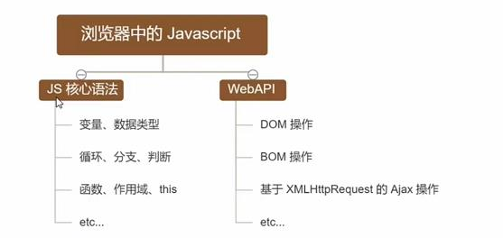
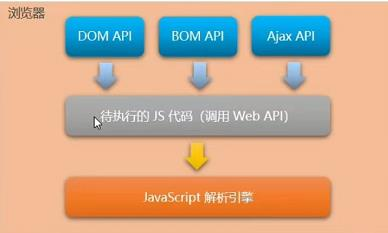
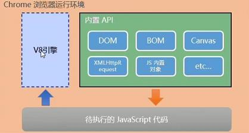
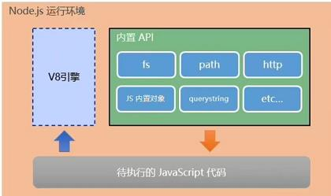
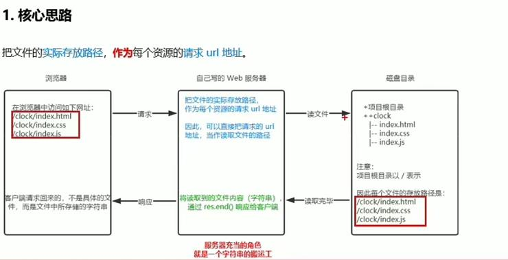

# node.js笔记
## 回顾与思考
浏览器中的JavaScript的组成部分




思考:为什么JavaScript可以操作DOM 和BOM
每个浏览器都内置了DOM、BOM这样的API函数，因此，浏览器中的JavaScript 才可以调用它们.



浏览器中的JavaScript运行环境
运行环境指的是代码正常运行所需要的必要环境(解析引擎和内置API不可或缺)



tip：
1.v8引擎负责解析和执行JavaScript代码
2.内置API是由运行环境提供的特殊接口，只能在所属的环境中被调用

JavaScript 能否做后端开发
可以！使用node.js

##  Node.js简介
```html
1.什么是Node.js
Node.jsRis a JavaScript runtime built on Chrome's V8 JavaScript engine.
Node.js 是一个基于Chrome V8引擎的JavaScript运行环境。(非浏览器)
2.Node.js 中的JavaScript运行环境
注意:
1.浏览器是JavaScript的前端运行环境。
2.Node.,js 是 JavaScript 的后端运行环境。
3.Node.js 中无法调用DOM和BOM等浏览器内置API。

```


## Node.js 环境的安装
```
如果希望通过Node.js 来运行Javascript代码，则必须在计算机上安装Node.js环境才行。
安装包可以从Node.js的官网首页直接下载，进入到Node.js的官网首页(https://nodejs.org/en/)，点击绿色的按钮，下载所需的版本后，双击直接安装即可。

1.区分LTS版本和Current版本的不同
LTS为长期稳定版，对于追求稳定性的企业级项目来说，推荐安装LTS版本的Node.js。
Current为新特性尝鲜版，对热衷于尝试新特性的用户来说，推荐安装Current版本的 Node.js。但是，Current版本中可
能存在隐藏的Bug 或安全性漏洞，因此不推荐在企业级项目中使用Current版本的Node.js.

2.查看已安装的Node.js的版本号
打开终端，在终端输入命令node -v后，按下回车键，即可查看已安装的Node.,js的版本号。
Windows系统快速打开终端的方式:
使用快捷键(Windows徽标键＋R)打开运行面板，输入cmd后直接回车，即可打开终端。

3.什么是终端
终端(英文: Terminal)是专门为开发人员设计的，用于实现人机交互的一种方式。
作为一名合格的程序员，我们有必要识记一些常用的终端命令，来辅助我们更好的操作与使用计算机。

4在Node.js环境中执行JavaScript代码
4.1
打开终端(win+r输入cmd)
输入cd <路径>
输入node <js文件名>

4.2
打开终端(在要运行的js文件夹中，长按shift不放，然后左键点击在此处打开powershell窗口)
输入node <js文件名>

1.终端中的快捷键

在Windows的powershell或cmd终端中，我们可以通过如下快捷键，来提高终端的操作效率:

1.使用↑键，可以快速定位到上一次执行的命令
2.使用tab键,能够快速补全路径
3.使用esc健，可以快速清空当前终端的内容
4.输入cls，可以快速清除终端

```
## 什么是fs 文件系统模块
```html
fs模块是Node.js官方提供的、用来操作文件的模块。它提供了一系列的方法和属性，用来满足用户对文件的操作需求。例如:
fs.readFile())方法，用来读取指定文件中的内容fs.writeFile()方法，用来向指定的文件中写入内容
如果要在JavaScript 代码中，使用fs模块来操作文件，则需要使用如下的方式先导入它:
const fs=require('fs')

```
## 读取指定文件内容
```html
fs.readFile()的语法格式
<script>
fs.readFile(path[,options],callback)
</script>

参数解读:
参数1:必选参数，字符串，表示文件的路径。
参数2:可选参数，表示以什么编码格式来读取文件。
参数3:必选参数，文件读取完成后，通过回调函数拿到读取的结果。

<script>
    //1.导入fs模块，来操作文件
const fs = require('fs');

//2.调用fs.readFile()方法来读取文件
//参数1：读取文件读取路径
//参数2：读取文件是采用的编码格式
//参数3：回调函数，拿到读取失败和成功的结果 err dataStr
fs.readFile('./files/1.txt', 'utf8', function(err, dataStr) {
    //打印的结果
    //读取成功 则err的值为null dataStr为执行读取
    //读取失败则 err的值为错误对象 dataStr的值为undefined
    console.log(err);
    console.log('----------');
    console.log(dataStr);
})
</script>
```
## 向指定的文件写入内容
```html
1. fs.writeFile()的语法格式
使用fs.writeFile(方法，可以向指定的文件中写入内容，语法格式如下:

fs.writeFile(file, data[,options], callback)

参数解读:
参数1:必选参数，需要指定一个文件路径的字符串，表示文件的存放路径。
参数2:必选参数，表示要写入的内容。
参数3:可选参数，表示以什么格式写入文件内容，默认值是utf8。
参数4:必选参数，文件写入完成后的回调函数。

<script>
const fs = require('fs')
//调用fs.writrFile()方法，写入文件内容
//参数1：表示文件存放路径
//参数2：表示要写入的内容
//参数3：回调函数
fs.writeFile('./files/1.txt', '我是帅哥', function(err) {
    //如果写入成功，则err为null
    //如果写入失败，则err为一个 错误对象
    console.log(err);
})</script>
```
## 案例写入考试成绩到另一个文件
```html
<script>
    const fs = require('fs')
    fs.readFile('./files/成绩.txt', 'utf8', function(err, dataStr) {
    if (err) {
        return console.log(err);
    }
    // console.log('读取文件成功' + dataStr);
    let arrold = dataStr.split(' ');
    let arr0 = [];
    arrold.forEach(item => {
        arr0.push(item.replace('=', ':'))
    });
    let newstr = arr0.join('\n');
    console.log(newstr);
    fs.writeFile('./files/成绩ok.txt', newstr, function(err) {
        if (err) {
            return err
        }
        console.log('写入成功');
    })
})</script>
```
## fs-处理路径问题
```html
在使用fs模块操作文件时，如果提供的操作路径是以/或../开头的相对路径时，很容易出现路径动态拼接错误的问题。
原因:代码在运行的时候，会以执行node命令时所处的目录，动态拼接出被操作文件的完整路径.

解决方案:在使用fs模块操作文件时，直接提供完整的路径，不要提供/或../开头的相对路径，从而防止路径动态拼接的问题
1.提供绝对路径
<script>
    const fs = require('fs')
    //绝对路径移植性非常差，不利于维护
    fs.readFile('C:\\Users\\ASUS\\Desktop\\node.js\\files\\1.txt', 'utf8', (err, dataStr) => {
    if (err) {
        return alert(err)
    }
    console.log(dataStr);
})
</script>
2.使用__dirname
<script>
    console.log(__dirname);
    const fs = require('fs')
    //__dirname表示当前文件所处的目录
    fs.readFile(__dirname + '/files/1.txt', 'utf8', (err, dataStr) => {
    if (err) {
        return alert(err);
    }
    console.log(dataStr);
})
</script>
```
## 什么是path路径模块
```html
path模块是Node,js 官方提供的、用来处理路径的模块。它提供了一系列的方法和属性，用来满足用户对路径的处理需求
例如:
path.join(方法，用来将多个路径片段拼接成一个完整的路径字符串path.basename(方法，用来从路径字符串中，将文件名解析出来
下
如果要在JavaScript 代码中，使用path模块来处理路径，则需要使用如下的方式先导入它:
<script>
const path = require('path')
</script>

2. path.join()的代码示例
使用path.join())方法，可以把多个路径片段拼接为完整的路径字符串:
<script>
    const pathStr = path.join( '/a','/b/c','../','./d','e')
    console.log(pathstr)//输出\a\b\d\e
    const pathStr2 = path.join( __dirname,'./files/1.txt')
    console.log(pathstr2)//输出当前文件所处目录\files\1.txt
</script>

注意:今后凡是涉及到路径拼接的操作，都要使用path.join()方法进行处理。不要直接使用＋进行字符串的拼接。该方法可以自动过滤掉(./)

<script>
console.log(__dirname);
const fs = require('fs')
const path = require('path')
    //__dirname表示当前文件所处的目录
fs.readFile(path.join(__dirname, './files/1.txt'), 'utf8', (err, dataStr) => {
    if (err) {
        return alert(err)
    }
    console.log(dataStr);
})
</script>

3.path.basename()的语法格式
使用path.basename()方法，可以获取路径中的最后一部分，经常通过这个方法获取路径中的文件名，语法格式如下:
<script>
path.basename(path[,ext])
</script>
参数解读:
path (字符串)必选参数，表示一个路径的字符串
ext (字符串)可选参数，表示文件扩展名(加上后返回结果不带该扩展名)
返回:(字符串)表示路径中的最后部分
<script>

const path = require('path');

const pathStr = '/a/aa/aaa/index.html'

const fullName = path.basename(pathStr)
console.log(fullName); //输出index.html

const fullName2 = path.basename(pathStr, '.html')
console.log(fullName2); //输出index
</script>

4.path.extname()的代码示例
使用path.extname(方法，可以获取路径中的扩展名部分:
<script>
const path = require('path')

const pathStr = '/a/aa/aaa/index.html';

console.log(path.extname(pathStr)); //输出.html
</script>
```
## 案例之拆分html(源码)
```html
<script>
    const fs = require('fs');
const path = require('path');

//匹配style的正则表达式
const regStyle = /<style>([\s\S]*)<\/style>/;
//匹配script的正则表达式
const regScript = /<script>([\s\S]*)<\/script>/;

//处理css
function resolveCSS(htmlStr) {
    const newCSS = regStyle.exec(htmlStr)[1];
    fs.writeFile(path.join(__dirname, './拆分文件/index.css'), newCSS, (err) => {
        if (err) {
            console.log('写入css失败');
        }
        console.log('写入css成功');
    })
}
//处理js
function resolveScript(htmlStr) {
    const newScript = regScript.exec(htmlStr)[1];
    fs.writeFile(path.join(__dirname, './拆分文件/index.js'), newScript, (err) => {
        if (err) {
            return console.log('写入js失败');
        }
        console.log('写入js成功');
    })
}
//处理html文件
function resolveHTML(htmlStr) {
    newHtml = htmlStr.replace(regStyle.exec(htmlStr)[0], '<link rel="StyleSheet" href="./index.css" />').replace(regScript.exec(htmlStr)[0], '<script src="./index.js"></script>');
    fs.writeFile(path.join(__dirname, './拆分文件/index.html'), newHtml, (err) => {
        if (err) {
            return console.log('写入html失败');
        }
        console.log('写入html成功');
    })
}
fs.readFile(path.join(__dirname, './拆分文件/index.html'), 'utf8', (err, dataStr) => {
    if (err) {
        return console.log('读取文件失败');
    }
    // console.log(dataStr);
    resolveCSS(dataStr);
    resolveScript(dataStr);
    resolveHTML(dataStr);
})
</script>

案例的两个注意点
1.fs.writeFile()方法只能用来创建文件，不能用来创建路径(不会新建一个文件夹放入指定文件，而是报错)
2.重复调用fs.writeFile(写入同一个文件，新写入的内容会覆盖之前的旧内容)

```
## 什么是http模块
```html
回顾:什么是客户端、什么是服务器?
在网络节点中，负责消费资源的电脑，叫做客户端;负责对外提供网络资源的电脑，叫做服务器。

http模块是Node.js官方提供的、用来创建web服务器的模块。通过 http模块提供的 http.createServer()方法，就能方便的把一台普通的电脑，变成一台Web服务器，从而对外提供Web资源服务。

如果要希望使用http模块创建Web 服务器，则需要先导入它:
<script>
const http = require("http")
</script>

```
## 服务器相关概念
```html
1.IР地址
IP地址就是互联网上每台计算机的唯一地址，因此IP地址具有唯一性。如果把“个人电脑”比作“一台电话”，那么“IP地址”就相当于“电话号码”，只有在知道对方IP地址的前提下，才能与对应的电脑之间进行数据通信。
IP地址的格式:通常用“点分十进制”表示成(a.b.c.d)的形式，其中，ab,c,d都是0~255之间的十进制整数。例如:用点分十进表示的IP地址(192.168.1.1)

注意:
互联网中每台Web服务器，都有自己的IP地址，例如:大家可以在Windows的终端中运行ping www.baidu.com命令，即可查看到百度服务器的IP地址。
在开发期间，自己的电脑既是一台服务器，也是一个客户端，为了方便测试，可以在自己的浏览器中输入127.0.0.1这个IP地址，就能把自己的电脑当做一台服务器进行访问了。

2.域名和域名服务器
尽管IРP地址能够唯一地标记网络上的计算机，但IP地址是一长串数字，不直观，而且不便于记忆，于是人们又发明了另一套字符型的地址方案，即所谓的域名(Domain Name)地址。
IP地址和域名是一—对应的关系，这份对应关系存放在一种叫做域名服务器(DNS，Domain name server)的电脑中。使用者只需通过好记的域名访问对应的服务器即可，对应的转换工作由域名服务器实现。因此，域名服务器就是提供IР地址和域名之间的转换服务的服务器。

注意:
单纯使用IP地址，互联网中的电脑也能够正常工作。但是有了域名的加持，能让互联网的世界变得更加方便。
在开发测试期间，127.0.0.1对应的域名是localhost，它们都代表我们自己的这台电脑，在使用效果上没有任何区别。

3.端口号
计算机中的端口号，就好像是现实生活中的门牌号一样。通过门牌号，外卖小哥可以在整栋大楼众多的房间中，准确把外卖送到你的手中。
同样的道理，在一台电脑中，可以运行成百上千个web服务。每个web服务都对应一个唯一的端口号。客户端发送过来的网络请求，通过端口号，可以被准确地交给对应的 web服务进行处理。

注意:
每个端口号不能同时被多个web服务占用。②在实际应用中，URL中的80端口可以被省略。

```
## 创建最基本的web服务器
```html
步骤1–导入http模块
如果希望在自己的电脑上创建一个web服务器，从而对外提供web 服务，则需要导入http模块:
<script>
    const http = require('http')
</script>

步骤2–创建web 服务器实例
调用http.createServer()方法，即可快速创建一个web 服务器实例:
<script>
    const server =http.createServer()
</script>

步骤3–为服务器实例绑定request事件
为服务器实例绑定request事件，即可监听客户端发送过来的网络请求:
<script>
    //使用服务器实例的.on()方法，为服务器绑定一个request事件，监听客户的请求
    server.on( "request", (req, res) => {
    //只要有客户端来请求我们自己的服务器，就会触发request 事件，从而调用这个事件处理函数
    console.log( 'Someone visit our web server.')
 })
</script>

步骤4–启动服务器
调用服务器实例的.listen(方法，即可启动当前的web 服务器实例:
<script>
//调用server.listen(端口号，cb回调）方法，即可启动 web服务器
server.listen(80，() => {
console.log('http server running at http://127.0.0.1')
})
</script>
注意：ctrl+c可以停止服务器
```
## req请求对象，res相应对象

```html
res请求对象
只要服务器接收到了客户端的请求，就会调用通过server.on()为服务器绑定的 request事件处理函数。如果想在事件处理函数中，访问与客户端相关的数据或属性，可以使用如下的方式:

res响应对象
在服务器的request事件处理函数中，如果想访问与服务器相关的数据或属性，可以使用如下的方式:

<script>
    const http = require('http')

    const serve = http.createServer();

    serve.on('request', (req,res) => {
    //req 是请求对象，他包含了与客户端相关的数据和属性
    //reg.url 是客户端请求的url地址(只有IP地址后面的字符)
    //req.method 是客户端的method请求类型
    const url = req.url;
    const method = req.method;
    const str = `Your request url is ${url},and request method is ${method}`
    console.log(str);
    //调用res.end方法，向客户端相应一些内容
    res.end(str)
})

    serve.listen(50, () => {
    console.log('server running at http://127.0.0.1:50');
})
    </script>
```
## 解决中文乱码问题
```html
当调用res.end()方法，向客户端发送中文内容的时候，会出现乱码问题，此时，需要手动设置内容的编码格式:
<script>
 serve.on('request', (req,res) => {
    const url = req.url;
    const method = req.method;
    const str = `请求地址是 ${url},请求方式是 ${method}`
    //调用res.setHeader('Content-Type','text/html;chartset=utf-8')这是固定格式
    res.setHeader('Content-Type', 'text/html; charset=utf-8');
    res.end(str)
})
    </script>

```

## 根据不同的url响应不同的html内容
```html
核心实现步骤
1.获取请求的url地址
2.设置默认的响应内容为404 Not found判断用户请求的是否为/或/index.html首页
3.判断用户请求的是否为/about.html关于页面
4.设置Content-Type响应头，防止中文乱码
5.使用res.end(把内容响应给客户端)
<script>
const http = require('http');
const server = http.createServer();
server.on('request', (req, res) => {
    const url = req.url;
    let content = '<h1>404 Not Found?</h1>';
    if (url === '/' || url === '/index.html') {
        content = '<h1>首页</h1>'
    } else if (url === '/about.html') {
        content = '<h1>关于</h1>'
    }
    res.setHeader('Content-Type', 'text/html; charset=utf-8');
    res.end(content);
});
server.listen(50, () => {
    console.log('server running http://127.0.0.1:50');
})
    </script>
```

## 4.6案例–实现网页的web服务器



```html
实现步骤
1.导入需要的模块
2.创建基本的web 服务器
3.将资源的请求url地址映射为文件的存放路径
4.读取文件内容并响应给客户端
5.优化资源的请求路径
<script>
    const http = require('http');
    const fs = require('fs');
    const path = require('path');

    const server = http.createServer();

server.on('request', (req, res) => {
    const url = req.url;
    // let fpath = path.join(__dirname, url);
    //优化路径
    let fpath = '';
    if (url === '/') {
        //127.0.0.1:50直接进入
        fpath = path.join(__dirname, '/click/index.html');
    } else {
        //127.0.0.1:50/index.html直接进入
        fpath = path.join(__dirname, '/click', url);
    }
    fs.readFile(fpath, 'utf8', (err, dataStr) => {
        if (err) {
            return res.end('404 not found');
        }
        res.end(dataStr);
    })
})

server.listen(50, () => {
    console.log('server running at http://127.0.0.1:50');
})
    </script>
```

## 模块化
```html
1.什么是模块化
复杂的文件拆分成好几个

2.编程领域中的模块化
编程领域中的模块化，就是遵守固定的规则，把一个大文件拆成独立并互相依赖的多个小模块。

把代码进行模块化拆分的好处:

1.提高了代码的复用性
2.提高了代码的可维护性
3.可以实现按需加载

1.2模块化规范
模块化规范就是对代码进行模块化的拆分与组合时，需要遵守的那些规则。

例如:
●使用什么样的语法格式来引用模块
●在模块中使用什么样的语法格式向外暴露成员

模块化规范的好处:大家都遵守同样的模块化规范写代码，降低了沟通的成本，极大方便了各个模块之间的相互调用，利人利己。

```
## Node.js中的模块化
```html
1 Node.js中模块的分类

Node.js 中根据模块来源的不同，将模块分为了3大类，分别是:
内置模块 (内置模块是由Node.js 官方提供的，例如fs、path、http等)
自定义模块（用户创建的每个.js文件，都是自定义模块)
第三方模块（由第三方开发出来的模块，并非官方提供的内置模块，也不是用户创建的自定义模块，使用前需要先下载)

```
## 加载模块
```html
使用强大的require(方法，可以加载需要的内置模块、用户自定义模块、第三方模块进行使用。例如:
<script>
//加载内置的fs模块
const fs =require('fs')
//加载用户的自定义模块(会立马执行custom.js的所有代码，custom是一个空对象，省略.js的后缀名也可以加载模块)
const custom = require('./custom.js');
//加载第三方模块(关于第三方模块的下载和使用，会在后面的课程中进行专门的讲解)
const moment =require('moment');

```

## Node.js模块作用域
```html
1.什么是模块作用域
和函数作用域类似，在自定义模块中定义的变量、方法等成员，只能在当前模块内被访问，这种模块级别的访问限制，叫做模块作用域。

作用：防治全局变量污染问题

2.向外共享模块作用域中的成员
module对象
在每个.js自定义模块中都有一个module对象，它里面存储了和当前模块有关的信息，打印如下:
Module {
  id: '.',
  path: 'C:\\Users\\ASUS\\Desktop\\node.js',
  exports: {},
  filename: 'C:\\Users\\ASUS\\Desktop\\node.js\\15-演示module对象.js',
  loaded: false,
  children: [],
  paths: [
    'C:\\Users\\ASUS\\Desktop\\node.js\\node_modules',
    'C:\\Users\\ASUS\\Desktop\\node_modules',
    'C:\\Users\\ASUS\\node_modules',
    'C:\\Users\\node_modules',
    'C:\\node_modules'
  ]
}

```
## module.exports对象
```
在自定义模块中，可以使用module.exports对象，将模块内的成员共享出去，供外界使用。
外界用require()方法导入自定义模块时,得到的就是 module.exports所指向的对象。

共享成员时的注意点:
使用require()方法导入模块时，导入的结果，永远以module.exports指向的对象为准。(让module.exports指向一个全新的对象，则之前的属性会被新属性覆盖)

exports对象
由于module.exports 单词写起来比较复杂，为了简化向外共享成员的代码，Node 提供了exports对象。默认情况下，exports和module.exports 指向同一个对象。最终共享的结果，还是以module.exports指向的对象为准。

exports和module.exports的使用误区
时刻谨记,require()模块时，得到的永远是 module.exports指向的对象(简单理解就是两个最开始指向的是同一个对象，如果两者有一个新赋值为一个新对象，则以module.exports指向的对象为主)

注意:为了防止混乱，建议大家不要在同一个模块中同时使用exports和module.exports
```
## Node.js遵循了CommonJS模块化规范
```
CommonJS规定了模块的特性和各模块之间如何相互依赖.
 
CommonJS规定:
每个模块内部，module变量代表当前模块。
module变量是一个对象，它的exports属性(即 module.exports）是对外的接口.加载某个模块，其实是加载该模块的module.exports属性。require()方法用于加载模块。
```